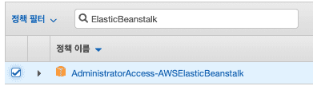

# 01. 도커와 AWS 업데이트로 인해 변환된 것들

강의를 다 듣고 다시 읽어 볼 것!


## 01-01. 도커 업데이트) Buildkit이 기본적으로 enable되는 현상

도커2.4.0+ 버전 업데이트로 인해 Buildkit을 기본적으로 사용할 수 있게 됨.

Buildkit을 사용하여 나타나는 현상은 도커 파일을 빌드할 때 나타남. => 빌드 과정에서 다른 출력 문구를 내보냄.

그 중 가장 주요한 차이점은 빌드 프로세스 마지막 부분에 나오는 **이미지 ID**


**기존 빌드 프로세스에서 나오는 출력 문구**

```text
--->   bd70880ecc90 
Successfully built bd70880ecc90 
```

**Buildkit이 기본으로 사용될 때**

```text
=> => exporting layers  0.0s
=> => writing image sha256:aa19c32ksj94839dj2-2039ccbd9cddd 0.0 s 
```


결론적으로 두개의 ID 모두 컨테이너를 실행할 수 있는 아이디이다. 

아래 두개 모두 같은 컨테이너를 실행하게됨.

`docker run bd70880ecc90 docker run aa19c32ksj94839dj2-2039ccbd9cddd  `


강의를 따라가기 위해서 Buildkit은 비활성화시키고 진행.

**Buildkit 비활성화 방법**

1. 도커 아이콘 클릭.

2. 아래 그림처럼 Preferences버튼 클릭

3. Docker Engine 버튼 클릭

4. buildkit키의 값을 false로 바꿔줌.

   ```text
   {
   	"experimetal": false,
   	"features": {
   		"buildkit": false,
   	},
   	"builder": {
           "gc": {
               enabled: true,
               "defaultKeepStorage": "20GB"
           }
   	}
   }
   ```

   


## 01-02. AWS 업데이트) ElasticBeanstalkFullAccess

IAM유저 권한을 주는 부분에 ElasticBeanstalkFulLAccess가 사라짐.

권한 대신에 `AdministratorAccess-AWSElasticBeanstalk`으로 주면된다.




## 01-03. AWS 업데이트) 일래스틱 빈스톡 플랫폼 브랜치

ElasticBeanstalk환경을 생성할 때 플랫폼 브랜치를 선택할 때

단일 컨테이너 애플리케이션을 이용할 떄(6-7강) `Docker running on 64bit Amazon Linux`를 사용했으며

멀티 컨테이너 애플리케이션을 이요할 때(8-9강) `Multi-container Docker running on 64but Zmazon Linux`를 사용함.

AWS에서 앞서 말한 두개의 플랫폼 브랜치의 사용 중단을 발표함. (2022년 6월 30일까지만 사용)

AWS에서 추천하는 플랫폼 브랜치인 `Docker running on 64bit Amazon Linux2`를 사용해서 만들었던 애플리케이션을 다시 배포


가장 큰 변화는 Linux2브랜치에서 `Dockerrun.aws.json`대신 `docker-compose.yml`을 이용.

(이후 내용 강의 수강 후 재작성.)