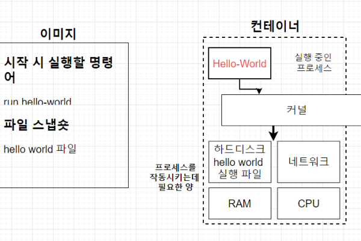
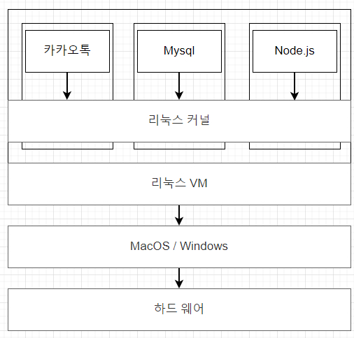

# 02. 도커 기본

## 02-01. 도커를 쓰는 이유

결론 부터 말하자면, **프로그램을 다운받는 과정을 간단하게 하기 위해**서.


원래 다운받을 때 아래 과정으로 진행된다.

`Installer 다운 -> Installer 실행 -> 프로그램 설치 완료.`

Insatller가 다른요소에 의해 영향을 받아  (갖고있는 서버, 패키지 버전, 운영체제 등등)

프로그램 설치 중 에러가 발생할 수 있고, 설치 과정이 복잡하다.


Redis를 도커없이 받을때와  도커를 이용해서 받아 차이를 알아보자.

### 도커 없이 Redis 다운받기

[📘 Redis 홈페이지 Install](https://redis.io/docs/getting-started/installation/install-redis-from-source/)

터미널에 아래 명령어 실행.

`wget https://download.redis.io/redis-stable.tar.gz`

에러가 발생한다. => wget이 없기 때문.

❗ 이렇게 이것 저것 부수적인것들이 없을때마다 추가설치해가면서 다운을 받아야한다.


### 도커로 Redis 다운받기

`docker run -it redis`

명령어 한번으로 설치가 끝난다.


## 02-02. 도커란 무엇인가?

**컨테이너**를 사용하여 응용프로그램을 더 쉽게 만들고, 배포하고 실행할 수 있도록 설계된 도구.

**컨테이너**기반의 오픈소스 가상화 플랫폼이며 생태계.

(docker 공식홈페이지에서 컨테이너를 먼저 설명할 만큼 중요하다.)

[📘 Docker 공식 홈페이지-컨테이너 설명](https://www.docker.com/resources/what-container/)


### 컨테이너란?

>  **서버에서 컨테이너 개념**
>
> 다양한 프로그램, 실행환경을 컨테이너로 추상화하고 동일한 인터페이스를 제공하여, 프로그램의 배포 및 관리를 단순하게 해준다.
>
> 일반 컨테이너의 개념에서 물건을 손쉽게 운송해주는 것 처럼 **프로그램을 손쉽게 이동 배포 관리**를 할 수 있게 해줌.
>
> AWS, Azure, Google cloud등 어디서든 실행 가능


## 02-03. 도커 이미지와 도커 컨테이너 정의

**컨테이너**는 코드와 모든 종속성을 패키지화 하여, 응용프로그램이 한 컴퓨팅 환경에서 다른 컴퓨팅 환경으로 빠르고 안정적으로 실행되도록 하는 소프트웨어의 표준단위.

=> 현재까지 여러가지 방향으로 컨테이너를 정의할 떄 **간단하고, 편리하게 프로그램을 실행 시켜주는 것**으로 정의내림.


**컨테이너 이미지**는 코드, 런타임, 시스템도구, 시스템 라이브러리 및 설정 같은 **응용프로그램을 실행하는데 필요한 모든 것을 포함**하는 가볍고 독립적이며 실행 가능한 **소프트웨어 패키지**


ex) 카카오톡을 실행한다면 카카오톡을 실행하기 위해 필요한 모든 설정및 종속성들을 도커 이미지가 가지고 있는 것.

도커 이미지를 이용해 컨테이너를 만들고, 컨테이너가 실행해서 어플리케이션이 컨테이너 안에서 돌아간다.


**컨테이너 이미지**는 `런타임에 컨테이너`가 되고, **도커 컨테이너**는 `도커 엔진에서 실행될 떄` 이미지가 컨테이너가 된다.

컨테이너는 소프트웨어를 환경으로부터 격리시키고, 개발과 스테이징의 차이에도 불구하고 **균일하게 작동하도록 보장**한다.


**정리**

도커 이미지는 프로그램을 실행하는데 필요한 모든 설정과 종속성을 가지고 있고, 

도커 이미지를 이용해 컨테이너를 생성한다.

그리고 생성된 도커 컨테이너를 이용해 프로그램을 실행한다.


## 02-04. MAC OS 도커 설치

Window를 이용하여 SKIP.


## 02-05. WINDOWS 도커 설치

Docker사이트 이동. -> Get started클릭 -> Docker Installer 다운 -> 설치.

❗ 윈도우 컨테이너 대신 리눅스 컨테이너를 사용할 것이기 때문에 설치 시 Configuration에서 체크해제.

(desktop 설치 후 실행시켰을 때 `wsl --update`를 하라는 경고가 뜬다. => Powershell을 켜서 실행시켜주어 해결)

cmd에서 버전확인하여 설치 확인.

```shell
docker version
```


## 02-06. Window Home 유저를 위한 도커 설치

Hyper-V라는 것이 필요한데 Home버전에서는 Hyper-V를 지원하지 않아 일반 윈도우버전 도커를 사용할 수 없다.

Docker Toolbox를 설치해서 사용해야 한다.

=> WSL이 윈도우에서도 리눅스 터미널을 사용할 수 있게 해주어 Docker Toolbox 설치 없이 리눅스 유저가 도커를 설치하는 것과 동일하게 설치할 수 있다.

강의 중 ddocker volume 강의에서 명령어를 사용하는데 윈도우 cmd, powershell터미널에서 명령어가 안먹히면, WSL을 통한 리눅스 터미널을 사용하면 된다.


## 02-07. 도커를 사용할 때의 흐름

### 항상 사용할  때

1. Docker CLI에 커멘드 입력
2. 도커 서버(도커 Daemon)이 커멘드를 받아서 그것에 따라 이미지를 생성하거나 컨테이너를 실행하거나 모든 작업을 하게 된다.

`도커 Client (CLI) -> 도커 Server (Daemon)`


CLI에서 커멘드를 입력해보자.

❗ `Docker is Running`상태여야 명령어 입력이 가능하다.

1. `docker run hello-world`

```shell
Unable to find image 'hello-world:latest' locally
latest: Pulling from library/hello-world
719385e32844: Pull complete
Digest: sha256:fc6cf906cbfa013e80938cdf0bb199fbdbb86d6e3e013783e5a766f50f5dbce0
Status: Downloaded newer image for hello-world:latest

Hello from Docker!
This message shows that your installation appears to be working correctly.

To generate this message, Docker took the following steps:
 1. The Docker client contacted the Docker daemon.
 2. The Docker daemon pulled the "hello-world" image from the Docker Hub.
    (amd64)
 3. The Docker daemon created a new container from that image which runs the
    executable that produces the output you are currently reading.
 4. The Docker daemon streamed that output to the Docker client, which sent it
    to your terminal.

To try something more ambitious, you can run an Ubuntu container with:
 $ docker run -it ubuntu bash

Share images, automate workflows, and more with a free Docker ID:
 https://hub.docker.com/

For more examples and ideas, visit:
 https://docs.docker.com/get-started/
```

`Unable to find image 'hello-world:latest' locally`라고 뜰 것이다.

이전에 이 이미지를 한 번도 로컬에다 저장시켜두지 않았기 때문에.

그래서 어디선가 hello-world를 가져와서 출력이된다.


**정리**

1. 도커 클라이언트에다가 커멘드를 입력하여 클라이언트에서 도커서버로 요청을 보냄.
2. 서버에서 hello-world라느 ㄴ이미지가 이미 로컬에 cache되있는지 확인
3. 이미지가 없어 `Unable to find image 'hello-world:latest' locally` 출력.
4. Docker Hub라는 이미지가 저장되있는 곳에서 이미지를 가져오고(pull) 로컬에 Cache로 보관.
5. 그후 이미지가 있으니 이미지를 이용해 컨테이너 생성


## 02-08. 도커와 기존의 가상화 기술과의 차이를 통한 컨테이너 이해

**가상화 기술이 나오기 전**

* 한대 서버를 하나의 용도로만 사용.
* 남는 서버 공간은 그대로 방치
* 하나의 서버에 하나의 운영체제, 하나의 프로그램만 운영
* 안정적이지만 비효율적.


**하이퍼 바이저 기반의 가상화 출현**

* **논리적으로 공간을 분할**하여 VM이라는 독립적인 가상환경의 서버 이용 가능
* **하이퍼 바이저**는 호스트 시스템(Window, Linux, ...)에서 **다수의 게스트 OS를 구동할 수 있게 하는** 소프트웨어
* 하드웨어를 가상화하면서 하드웨어와 각각의 VM을 모니터링 하는 **중간 관리자**


하이퍼 바이저는 2가지로 나뉜다.

`네이티브 하이퍼 바이저`와 `호스트형 하이퍼 바이저`

**네이티브 하이퍼 바이저**

`하드웨어 -> 하이퍼바이저 -> OS`

* 하드웨어를 직접 제어함.
* 자원을 효율적으로 사용가능하며, 별도의 호스트 OS가 없어 오버헤드가 적다.
* 여러 하드웨어 드라이버를 세팅해야 하므로 설치가 어렵다.

**호스트형 하이퍼 바이저**

`하드웨어 -> OS(Host) -> 하이퍼 바이저 -> OS(Guest)`

* 일반적인 소프트웨어처럼 호스트OS위에 실행됨.
* 하드웨어 자원을 VM내부의 게스트 OS에 에뮬레이트 하는방식으로 오버헤드가 크다.
* 게스트 OS종류에 대한 제약이 없고 구현이 다소 쉽다.
* 일반적으로 많이 사용한다.

> ❗ 오버헤드란?
>
> 프로그램의 실행흐름에서 나타나는 현상중 하나로, 특정 기능을 수행하는데 드는 간접적인 시간, 메모리등 자원을 말한다
>
> 예를 들어 , 프로그램의 실행흐름 도중에 동떨어진 위치의 코드를 실행시켜야 할 때 , 추가적으로 시간,메모리,자원이 사용되는 현상
>
>  10초 걸리는 기능이 간접적인 원인으로 20초걸린다면 오버헤드는 10초가 되는것이다. 


Core가2개가 있으면, 하나씩 독립된 가상 하드웨어의 자원을 받는다.

Core1은 VM1, Core2는 VM2로. 

VM1이 에러가나도 VM2에 에러가 퍼지지 않는다.

이런 기술을 토대로 도커 컨테이너 기술이 나온것.


### 도커와 기존 가상화기술(VM) 비교


**공통점**

* 기본 하드웨어에서 격리된 환경 내에 애플리케이션을 배치하는 방법.

**차이점**

* 격리된 환경을 얼마나 격리시키는지 차이가 있다.
* VM과 비교했을 때 컨테이너는 하이퍼 바이저와 게스트 OS가 필요하지 않아 더 가볍다.
* 애플리케이션을 실행할 때 
  * `컨테이너 방식`에서는 **호스트 OS위에** 애플리케이션의 실행패키지인 이미지를 배포하면 됨.
  * `VM`은 **VM을 띄우고** **자원을 할당**한 다음, **게스트 OS를 부팅**하여 애플리케이션을 실행해야해서 훨씬 복잡하고 무겁게 실행 해야함.

**도커 컨테이너**

`도커 컨테이너`에서 돌아가는 애플리케이션은 컨테이너가 제공하는 격리 기능 내부에 샌드박스가 있지만,<br/>여전히 같은 호스트의 다른 컨테이너와 **동일한 커널을 공유**함.<br/>=> 호스트OS에다가 이미지를 올린다. 그렇기 때문에 동일한 커널을 공유함.<br/> VM의 경우 Guest OS를 따로 띄워 실행한다.

결과적으로 컨테이너 내부에서 실행되는 프로세스는 `호스트 시스템`에서 볼 수 있다.

Example

Docker와 함께 MongoDB 컨테이너를 시작하면, 호스트(도커가 아님)의 일반 쉘에 `ps-e grep 몽고`를 실행하면 프로세스가 표시됨. <br/>컨테이너에서 MongoDB에서 실행하면, 호스트에서 확인이 가능하다.

또한, 컨테이너가 전체 OS를 내장할 필요가 없는 결과 매우 가볍고, 일반적으로 5~100MB다.


**가상 머신**

VM 내부에서 **실행되는 모든 것은 호스트 운영체제 또는 하이퍼 바이저와 독립**되어 있다.<br/>가상 머신 플랫폼은 특정 VM에 대한 가상화 프로세스를 관리하기 위해 프로세스를 시작하고, 호스트 시스템은 그것의 하드웨어 자원의 일부를 VM에 할당함.

VM과 근본적으로 다른 것은 시작 시간에 VM환경을 위해 새롭고 이 특정 VM만을 위한 커널을 부팅하고, 운영체제 프로세스 세트를 시작한다는 것.

응용 프로그램만 포함하는 일반적인 컨테이너 보다 VM크기를 훨씬 크게 만든다.

간단할 수 있지만 굉장히 느리다.

=> Guest OS도 있고, 하이퍼바이저도 있어 오버헤드가 크다는 내용

---


### 어떻게 도커 컨테이너를 격리 시키는가?


사진을 보면 같은 커널을 공유하고, <br/>카카오톡, 크롬, 노션이 각각의 컨테이너 안에서 격리가 되있고, 하드 디스크 안에 각 프로그램을위한 파일 시스템(CPU, 메모리)가 다 격리 되있는 것을 볼 수 있다.

**how?**

도커 컨테이너 기술이 하이퍼바이저기반의 VM에서 발전된 것이다.

리눅스에서 쓰이는 `C Group`과 네임스페이스 기술을 가져온 것이다.

이것들은 컨테이너와 호스트에서 실행되는 **다른 프로세스 사이에 벽을 만드는** `리눅스 커널의 기능들`이다.

**C Group**

CPU, 메모리, Network Bandwith, HD i/o등 프로세스 그룹의 시스템 **리소스 사용량을 관리**.<br/>=> 어떤 어플이 사용량이 너무 많다면, 그 어플리케이션 같은 것을 C group에 집어 넣어 CPU와 메모리 사용 제한 가능.

**네임 스페이스**

하나의 시스템에서 프로세스를 격리시킬 수 있는 가상화 기술<br/>별개의 독립된 공간을 사용하는 것처럼 격리된 환경을 제공하는 경량 프로세스 가상화 기술


## 02-09. 이미지로 컨테이너 만들기

이미지는 응용프로그램을 실행하는데 필요한 모든 설정이나 종속성들을 가지고 있다.

우선 필요한게 뭔지 알아보자.

**이미지에 들어 있는 것**

* 시작시 실행 될 명령어
* 파일 스냅샷 (디렉토리나 파일을 카피한 것)


### 이미지로 컨테이너를 만드는 순서

1. Docker 클라이언트에 `docker run <이미지>`를 입력
2. 도커 이미지에 있는 파일 스냅샷을 컨테이너 하드 디스크에 옮겨 줌.
3. 이미지가 가지고 있는 명령어를 이용해 카카오톡을 실행시킴.




## 02-10. C-group, 네임스페이스를 도커 환경에서 쓸 수 있는 이유

컨테이너를 격리 시킬 수 있는 이유가 `C Group`과 `네임스페이스`이다.

`namespace`는 프로그램이 어떤 파일시스템을 이용하거나 커널을 통해 나눠주는 것을 해주고, `C Group`은 사용하는 리소스를 관리한다고 했다.

그런데 사용자마다 OS가 다른데 리눅스에서 사용하는 두가지를 어떻게 사용하는 것일까

cmd를 키고 docker version을쳐보면, 

```shell
Client:
...

Server: Docker Desktop 4.19.0 (106363)
 ...
  OS/Arch:          linux/amd64
...
```

OS가 linux로 되있는 것을 볼 수 있다.


내부적으론 아래 사진처럼 동작하고 있는 것이다.



컴퓨터 상에서 Window를 사용하고, 컨테이너 부분에 리눅스 VM이 설치 되있다.

사용은 Window나 Mac에서 하지만, Docker가 돌아갈 때, 리눅스에서 돌아간다는 것이다.

그래서 리눅스 커널을 사용하여, `C Group`과 `namespace`를 사용할 수 있는 것.