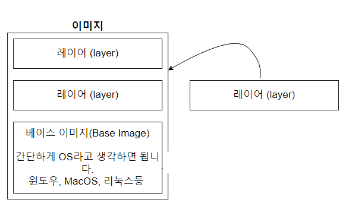
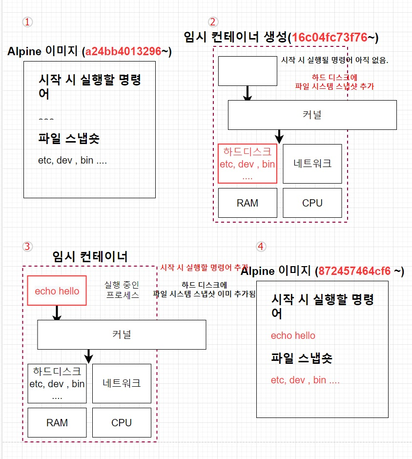
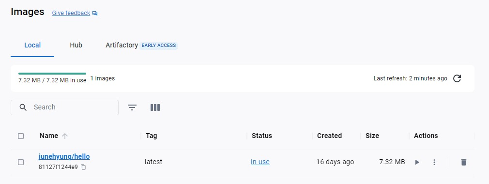

# 04. 직접 도커 이미지 만들어 보기

## 04-01. 도커 이미지 생성하는 순서

항상 도커 허브에 이미 있던것들만 가져와 사용했었다.

도커 이미지를 만들어서 사용할수도 있고, 직접 만든 이미지를 도커 허브에 올려 공유할 수도 있다.


### 복습

1. 도커 이미지는 컨테이너를 만들기 위해 필요한 설정이나 종속성들을 갖고있는 소프트웨어 패키지
2. Docukerhub에 이미 다른 사람들이 만든 것을 이용할수도있고, 직접 도커이미지를 만들어 Dockerhub에 업로드 할 수도 있다.


**도커 이미지를 이용해 도커 컨테이너를 생성**

`docker create [ 이미지 이름 ]`


### 도커 이미지 생성

컨테이너는 도커이미지로 생성한다.

도커 이미지는?


**도커 이미지 생성 순서**

`Docker File 생성 -> 도커 클라이언트 -> 도커 서버 -> 이미지 생성`

* Dockerfile 작성
  * `Docker File`이란 Docker Image를 만들기 위한 **설정 파일**
  * 컨테이너가 어떻게 행동해야 하는지에 대한 설정들을 정의.
* 도커 클라이언트
  * `Docker File`에 입력된 것들이 도커 클라이언트에 전달되야함.
* 도커 서버
  * 도커 클라이언트에 전달된 모든 중요한 작업들을 하는 곳
* 이미지 생성


## 04-02. Dockerfile만들기

#### 도커 파일(Docker File)이란?

도커 이미지를 만들기 위한 설정 파일.

컨테이너가 어떻게 행동해야 하는지에 대한 설정들을 정의


### 도커 파일 만드는 순서

먼저, 도커 이미지가 필요한 것이 무엇인지를 생각. <br/>=> 이미지를 만들기 위한 설정파일이므로 무엇이 필요한지 생각한 후 명시.

> 이미지에 필요한 것
>
> * 시작시 실행될 명령어
> * 파일 스냅샷

1. `베이스 이미지`를 명시 (파일 스냅샷에 해당)
2. 추가적으로 필요한 파일을 다운 받기 위한 명령어를 명시 (파일 스냅샷에 해당)
3. 컨테이너 시작시 실행 될 명령어를 명시. (시작시 실행될 명령어)

> 베이스 이미지?
>
> 도커 이미지는 **여러개의 레이러로 구성** 되있다.<br/>그중 베이스 이미지는 이 이미지의 기반이 되는 부분이다.
>
> (레이어는 중간 단계의 이미지라 생각.)
>
> 
>
> 이미지 안에 어떤 추가 요소를 넣으면, 레이어 하나가 추가가 되는 것이다. (추가 되는 것을 레이어 캐싱이라 함)
>
> 이 레이어들 중에서 가장 근본이 되고, 기본이 되는 것이 `베이스 이미지`


### 실습

**목표**

"hello 문구 출력"

**순서**

1. 도커 파일을 만들 폴더 하나 만들기 (practice-04_docker-folder로 진행)
2. 해당위치에서 Editor 실행
3. dockerfile이름으로 파일 생성
4. 어떻게 진행해 나갈지 base 명시

기본 뼈대

```dockerfile
# 베이스 이미지를 명시해준다.
FROM baseImage

# 추가적으로 필요한 파일들을 다운로드 받는다.
RUN command

# 컨테이너 시작시 실행될 명령어를 명시해준다.
CMD ["executable"]
```

**FROM**

이미지 생성 시 기반이 되는 이미지 레이어.<br/>`<이미지 이름> <태그>`형식으로 작성.<br/>태그를 안붙이면 자동으로 가장 최신것을 다운받음.<br/>ex) ubuntu: 14.04

RUN

도커 이미지가 생성되기 전에 수행할 쉘 명령어

CMD

컨테이너가 시작되었을 때 `실행할 실행파일 또는 셸 스크립트`<br/>**DockeFile내 1회만 사용가능.**


5. 베이스 이미지부터 실제 값으로 추가.
6. 베이스 이미지는 ubuntu를 써도 되고, centos등을 써도 되지만, hello출력은 사이즈가 큰 베이스 이미지를 쓸 필요가 없어 사이즈가 작은 alpine을 사용.
7. hello 문자를 출력해 주기 위해 echo를 사용해야하는데 alpine안에 echo를 사용하게 할 수 있는 파일이 있어 RUN 부분은 생략.

```dockerfile
# 베이스 이미지를 명시해준다.
FROM alpine

# 추가적으로 필요한 파일들을 다운로드 받는다.
# RUN command

# 컨테이너 시작시 실행될 명령어를 명시해준다.
CMD ["echo", "hello"]
```


## 04-03. 도커 파일로 도커 이미지 만들기

도커파일에 입력된 것들이 도커클라이언트에 전달되어 **도커 서버가 인식**하게 해야한다.

`docker build ./` 또는 `docker build .`

build뒤에 도커파일이 있는 경로를 명시.

> Build 명령어
>
> 해당 디렉토리 내에서 `dockerfile`이라는 파일을 찾아 **도커 클라이언트에 전달**시켜 준다.

먼저 alpine base 이미지를 가져오고,

intermediate container라는 임시 컨테이너를 지워주고 새로운 이미지를 만들어준다.


**만들어지는 순서**



1. alpine이미지를 가져옴.<br/>이 이미지에는 많은 레이어들이 있고, alpine에 필요한 스냅샷 존재.
2. 임시 컨테이너 생성.<br/>하드 디스크에 파일 시스템 스냅샷 추가
3. 시작시 실행할 명령어 추가 (임시 컨테이너 완성)
4. 임시컨테이너로 이미지 생성 (새로운 아이디)


### 결론

베이스 이미지에서 다른 종속성이나 새로운 커멘드를 추가할 떄는 **임시 컨테이너를 만든 후 그 컨테이너를 토대로 새로운 이미지를 만든다. 그리고 그 임시 컨테이너는 지운다.**


## 04-04. 내가 만든 이미지 기억하기 쉬운 이름 주기

만들어진 이미지 아이디가 너무길고 복잡한 형식인것을 볼 수 있다.

제일 처음 실습했던 hello-world처럼 원하는 이름을 줄 수 있다.


### 도커 이미지에 이름 주는 방법

옵션을 주면된다.

`docker build -t [나의 도커 아이디]/[저장소,프로젝트이름]:[버전]`형식이다.

ex) docker build -t johnahn/hello:latest

❗ -t뒤에 아무렇게나 올 수는 있지만, 규칙을 지킨다.

```shell
docker build -t junehyung/hello:latest ./
```

**결과**

```shell
[+] Building 2.4s (6/6) FINISHED
...
 => => naming to docker.io/junehyung/hello:latest 
```

