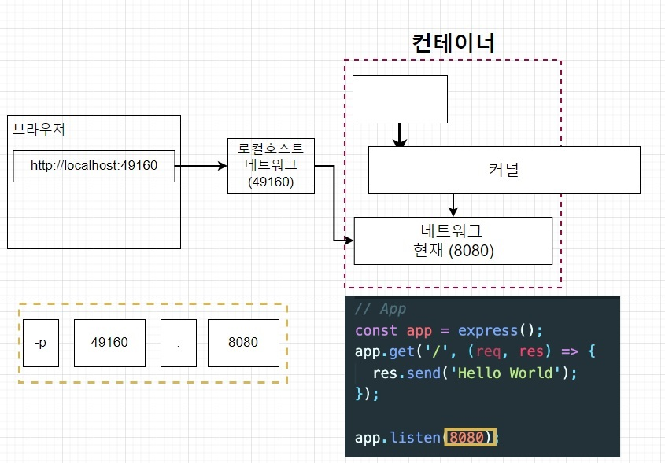
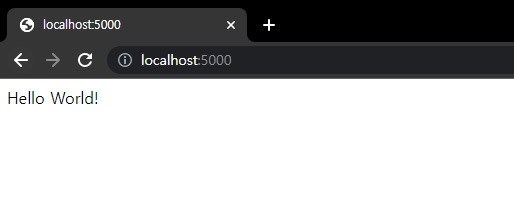
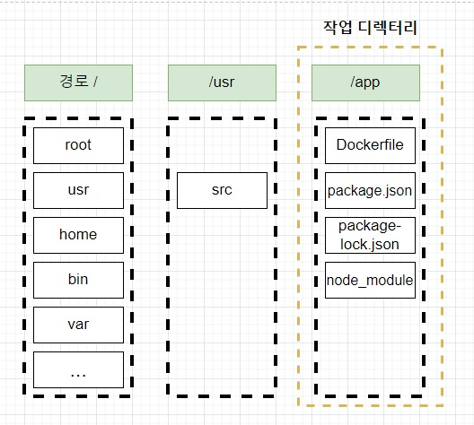
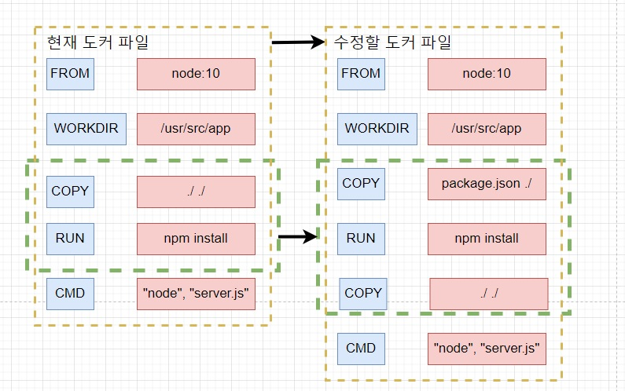

# 05. 도커를 이용한 간단한 Node.js 어플 만들기

## 05-01. 섹션 설명

간단한 Nodejs 어플리케이션 만들 것이다.

[📘 node.js 공식문서 참고 링크](https://nodejs.org/en/docs/guides/nodejs-docker-webapp)

❗ 어떤식으로 작성하는지 중점적으로 볼 예정.

**순서**

Node.js App을 만들고 -> 도커 이미지 생성 후 컨테이너에서 실행.


## 05-02. Node.js 앱만들기

### Node.js 앱 만들기 순서

**package.json -> server.js**

* package.json : 프로젝트의 정보와 사용중인 패키지의 의존성을 관리
* server.js : **시작점( Entry Point )**로서 가장 먼저 시작되는 파일


**package.json을 먼저 만들자.**

`npm init`을 통해 파일을 생성.

```shell
npm init
```

그 후 dependencies에 `express`를 설정하고, scripts에 server.js를 시작하는 start 명령어 등록.

> express
>
> Javascript와 Jquery의 관계처럼, Node.js의 API를 단순화하고, 새로운 기능을 추가해 Node.js를 더 쉽고 유용하게 사용할 수 있게 해준다.

```json
// package.json
{
  "name": "05_nodejs-docker-app",
  "version": "1.0.0",
  "description": "nodejs app",
  "main": "server.js",
  "scripts": {
    "start": "node server.js",
    "test": "echo \"Error: no test specified\" && exit 1"
  },
  "dependencies": {
    "express": "4.18.2"
  },
  "author": "JuneHyung",
  "license": "ISC"
}
```


**server.js(시작점) 만들기**

편의상 HOST를 따로 지정하지 않고, 진행

```javascript
const express = require('express');

const PORT = 8080; // Express 서버를 위한 포트 설정
// const HOST = '0.0.0.0'; // 호스트 지정

// App
const app = express(); // 새로운 Express 어플 생성
app.get('/', (req, res)=>{ // '/' 경로로 요청이 오면 Hello World를 결과값으로 전달.
  res.send('Hello World!');
});

// app.listen(PORT, HOST); // 해당 포트와 호스트에서 HTTP 서버를 시작
app.listen(PORT); // 해당 포트와 호스트에서 HTTP 서버를 시작
// console.log(`Running on http://${HOST}: ${PORT}`);
```


## 05-03. Dockerfile 작성하기

### Node.js 앱을 도커 환경에서 실행하려면 

`Docker 이미지 생성` -> `컨테이너 실행` -> `컨테이너 안에서 Node.js앱을 실행`

이 도커 이미지 생성을 위해 Dockerfile을 먼저 만들어야 한다.


### 복습

```docker
# 베이스 이미지 명시
FROM baseImage

# 추가적으로 필요한 파일들 다운
RUN command

# 컨테이너 시작시 실행 될 명령어를 명시
CMD ["executable"]
```

* **FROM** : 이미지 생성시 기반이 되는 이미지 레이어.<br/>`[이미지 이름][태그]` 형식으로 작성<br/>ex) ubuntu:14.04
* **RUN** : 도커이미지가 생성되기 전에 수행할 쉘 명령어
* **CMD** : 컨테이너가 시작되었을 때 실행할 실행 파일 또는 셸 스크립트.<br/>DockerFile내 1회만 사용가능.


### 실습

Dockerfile을 만들어보자.

베이스 이미지로는 `node: 10` (FROM)

추가적인 파일로는 `npm install` (RUN)

실행될 명령어로는 `"node", "server.js"` (CMD)

```dockerfile
FROM node:10

RUN npm isntall

CMD ["node", "server.js"]
```

>  **왜 node를 base image로 사용하는가?** 
>
> `npm install`이란 명령어를 사용해야하는데 alpine 이미지는 가장 최소한의 경량화된 파일들이 있어 npm을 위한 명령어가 없다.<br/>(FROM을 alpine으로 하면 `npm not found` 에러가 발생)
>
> 그렇기 때문에 npm이 들어있는 베이스 이미지인 node 이미지 사용.

CMD ["node", "server.js"]는 노드 웹 서버를 작동시키려면, `node + 엔트리 파일이름`을 입력해야 한다.


```shell
docker build ./
```

위 명령어로 빌드하여 확인해 보면, 에러가 날 것이다.


## 05-04. package.json파일이 없다고 나오는 이유

결론을 먼저 살펴보자면, `COPY`를 이용할 것이다.


Node 베이스 이미지를 사용해 임시컨테이너를 만든 다음 임시 컨테이너로 실제 사용할 이미지를 생성한다.

임시 컨테이너로 만들 때 파일 스냅샷을 임시 컨테이너의 하드디스크에 넣어주고, `npm install`을 하게 될텐데.

이 때 package.json이 없다고 뜨는 것이다.

`npm install`시 package.json을 찾아서 설치해야하는데 현재 **임시 컨테이너 밖에 있다.**


**정리**

`npm install`을 통해 `package.json`을 보고 명시된 종속성들을 다운 받아 설치해주는데, **`package.json`이 컨테이너 안에 없기 때문에 찾을 수 없다는 에러가 발생.**


**해결책**

컨테이너 안으로 이동시켜주어야 한다. => **COPY 이용**

`COPY package.json ./`

`package.json` : 로컬에 있는 이파일을 (**복사 할 파일 경로**)

`./` : 도커 컨테이너의 지정된 장소에 복사 (**컨테이너 내에서 파일이 복사될 경로**)

```dockerfile
FROM node:10

COPY pacakge.json ./

RUN npm isntall

CMD ["node", "server.js"]
```


원하는 이름을줘서 build해보자.

```shell
docker build -t junehyung/nodejs ./
```


이제 이미지로 컨테이너를 만들기 위해 `docker run 이름`을 하게되면 에러가 날것이다.

```shell
...
Error: Cannot find module '/server.js'
    at Function.Module._resolveFilename (internal/modules/cjs/loader.js:636:15)
    at Function.Module._load (internal/modules/cjs/loader.js:562:25)
    at Function.Module.runMain (internal/modules/cjs/loader.js:831:12)
    at startup (internal/bootstrap/node.js:283:19)
    at bootstrapNodeJSCore (internal/bootstrap/node.js:623:3)
```

server.js를 찾지 못한다는 에러다.

그 이유는 server.js도 컨테이너 안에 없기 때문에 에러가 발생한다.

server.js와 package.json모두 복사하기 위해 현재 디렉토리 전체를 복사하도록 수정.

```dockerfile
FROM node:10

COPY ./ ./

RUN npm isntall

CMD ["node", "server.js"]
```

수정 후 다시 build해주고 run을 해보자.

```shell
docker run junehyung/nodejs 
```

```shell
Server is running!
```

server.js에서 찍은 console이 출력되는 것을 확인할 수 있다.

서버가 잘 돌아가는지 확인하기위해 브라우저에서 `localhost:8080`을 쳐보면, 잘 안돌아 가고있는걸 볼 수 있다.


## 05-05. 생성한 이미지로 어플리케이션 실행 시 접근이 안되는 이유

**현재까지 컨테이너를 실행하기 위해 사용한 명령어**

`docker run [이미지 이름]`

**앞으로 컨테이너를 실행하기 위해 사용할 명령어**

`docker run -p 49160 : 8080 이미지이름`


새로 추가된 부분을 살펴보자.

이미지를 만들 떄 로컬에 있던 파일(package.json, server.js,...)등을 컨테이너에 복사 해줬다.

이와 비슷하게 네트워크도 **로컬 네트워크에 있던 것을 컨테이너 내부에 있는 네트워크에 연결**시켜주어야 한다.



컨테이너 안에서는 8080을 사용한다.

브라우저에서 8080을 쳐서 컨테이너안의 네트워크(8080)에 들어 가기 위해서 포트를 매핑  시켜주어야한다.

그 부분이 `-p 49160 : 8080` 으로 추가된 부분이다. <br/>(앞이 브라우저에서 입력할 포트번호,  뒤가 연결될 컨테이너의 포트번호)


`docker run -p 5000:8080 [이미지 이름]`으로 다시 해보자.



5000번으로 접근이 가능한 것을 확인할 수 있다.


## 05-06. Working Directory 명시해주기.

```dockerfile
WORKDIR /usr/src/app
```

Work Directory에 대해 알아보자.

**이미지 안에서 어플리케이션 소스 코드를 갖고 있을 디렉토리를 생성하는 것.**


**왜 따로 있어야 하는가?**

Node이미지의 파일 스냅샷에 home, bin, dev등의 파일이 있다.

`docker run -it node ls`를 통해 확인해보면

```shell
Status: Downloaded newer image for node:latest
bin  boot  dev  etc  home  lib  lib64  media  mnt  opt  proc  root  run  sbin  srv  sys  tmp  usr  var
```

이렇게 확인할 수 있다.


현재 만든 이미지의 Root 디렉토리를 보면,

```shell
docker run -it junehyung/nodejs ls 
bin   dev         etc   lib    media  node_modules  package-lock.json  proc  run   server.js  sys  usr
boot  dockerfile  home  lib64  mnt    opt           package.json       root  sbin  srv        tmp  var
```

source code로 넣은게 안에 들어있는 것을 볼 수 있다.

node앱을 위해 COPY로 이미지 안에 들어온 것들.

* Docker File
* package.json
* package-lock.json
* node_module


### workDir을 지정않고 그냥 COPY할떄 생기는 문제점

1. 원래 이미지에 있던 파일과 이름이 같다면?

   COPY할 파일 이름이 원래 시스템의 파일 이름과 같아버리면, 원래 시스템의 파일을 덮어씌워버린다.

2. 모든 파일이 한 디렉토리에 들어가 버려 정돈이 안되있다.

=> **❗ 모든 어플리케이션을 위한 소스들은 WORK 디렉토리를 만들어 보관한다.**


### WORK DIRECTORY 만드는 방법

`WORKDIR [지정할 디렉토리]`

```dockerfile
FROM node:10

WORKDIR /usr/src/app

COPY ./ ./

RUN npm isntall

CMD ["node", "server.js"]
```


`docker run -it [이미지이름] sh`로 워크디렉토리에 파일이 잘 들어가있는지 확인.

들어가서 `ls`로 확인.

```shell
dockerfile  node_modules  package-lock.json  package.json  server.js
```

❗ WORKDIR 설정 후 터미널에 들어오면, 기본적으로  WORKDIR에서 시작하게 된다.

WORKDIR을 설정해두면, 컨테이너에 접근할 때 루트디렉토리가 아니라 WORKDIR에 먼저 접근하기 때문에, root파일들이 아니라 COPY한 것들만 바로 확인.

현재 상황은 이렇게 되있다.




## 05-07. 어플리케이션 소스 변경으로 다시 빌드하는 것에 대한 문제점

소스코드를 변경하면, 변경된 부분을 반영하기 위해 처음부터 다시 이미지 빌드부터 해줬는데 그에 따른 문제점을 살펴보자.

**현재까지의 상황**

`도커파일 작성 - docker build -> 도커파일로 더커이미지 생성 - docker run -> 도커 이미지로 컨테이너 생성 후 앱실행`

소스 하나 변경됐다고 이 과정을 다시 다하는 건 비효율적이다.


Helloworld를 다른 텍스트로 바꾸고 다시 이미지를 만들자.

이번엔 -d 옵션을 사용해볼 것이다.

`docker run -d -p 5000:8080 junehyung/nodejs`

컨테이너의 아이디만 출력하고 터미널로 나와진다. => -d 옵션<br/>(`docker ps`로 컨테이너가 실행중인걸 확인 가능.)

안녕하세요로 변경된 것을 확인할 수 있다.


COPY해서 컨테이너에 넣어주고있는데,  수정 후 다시 COPY하여 넣어주려면 build부터 다시 해주어야한다.

=> **비효율적**이다.


## 05-08. 어플리케이션 소스 변경으로 재빌드시 효율적으로 하는 법

우선 완성된 Dockerfile을 살펴보자.

```dockerfile
FROM node:10

WORKDIR /usr/src/app

# Install app dependencies
COPY package*.json ./

RUN npm isntall

# Bundle app source
COPY . .

EXPOSE 8080
CMD ["node", "server.js"]
```



COPY가 2개가 됐다

package.json만 먼저 다운받고, 그 다음 전체 코드를 복사한다.


왜 이렇게 바꾸는지 알아보자.

기존 방식대로 하면, 변경없이 build하게 되면, npm install 시 캐시되어 이미지가 굉장히 빠르게 빌드된다.

하지만 수정하고 build를 하면, npm의 종속성을 다시 다운 받고있다.

```dockerfile
COPY package.json ./

RUN npm install

COPY ./ ./
```

종속성 부분만 먼저, npm install을 해준다.

source를 변경하면, package.json이 변경된게 아니기 때문에, 불필요한 다운을 받지 않고,  source부분만 다시 다운받는다.


## 05-09. Docker Volume에 대해.

> 시작하기전에
>
> 맥에서 `-v $(pwd):/usr/src/app`
>
> 윈도우에서 `-v %cd%:/usr/src/app`
>
> 이런 식으로 다르게   $(pwd) => %cd% 이렇게 다르게 사용
>
> ❗ window에서 ${pwd}로 명령어 사용.

**Docker Volume**

소스를 변경할때마다 변경된 소스부분은 COPY한 후 이미지를 다시 빌드 해주고, 컨테이너를 다시 실행해줘야 변경된 소스가 화면에 반영된다.

이런 작업은 너무 시간소요가 크고, 이미지도 너무 많이 빌드하기 때문에 **Volumne**을 사용한다 


**COPY**

이미지를 다시 빌드해주어야 컨테이너에 `복사`가 된다.

**VOLUME**

컨테이너가 Docker volume을 이용해 Local에 있는 파일들을 **참조한다**


Volume을 사용해 어플리케이션 실행하는법

`docker run -p 5000:8000 -v /usr/src/app/node_modules -v ${pwd}:/usr/src/app [이미지 아이디]`

* **-v /usr/src/app/node_modules** : 호스트 디렉토리에 node_module은 없기에 컨테이너에 매핑하지 말라고 하는것<br/>(usr/src/app은 WORKDIR을 지정해준곳)
* **-v ${pwd}:/usr/src/app** : ${pwd} 경로에 있는 디렉토리 혹은 파일을 /usr/src/app경로에서 참조<br/>(%cd% 는 어디서 실행할지.)

❗ PWD (print working directory) : 현재 작업중인 디렉터리의 이름을 출력하는데 쓰인다.


