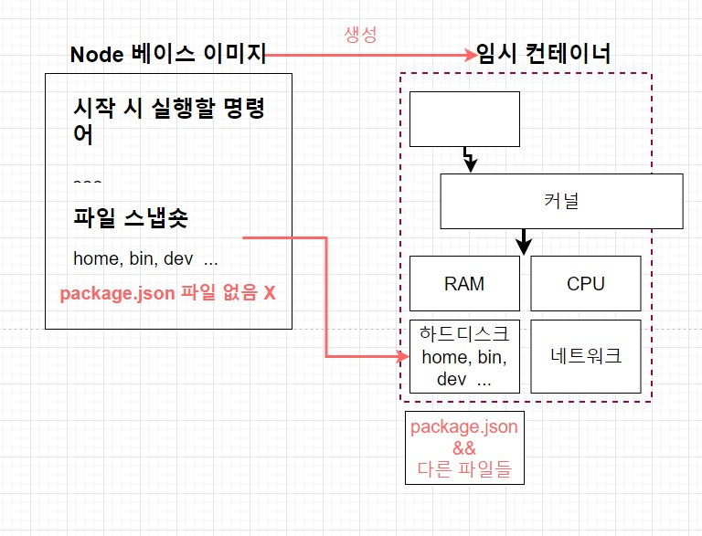

# 05. 도커를 이용한 간단한 Node.js 어플 만들기

## 05-01. 섹션 설명

간단한 Nodejs 어플리케이션 만들 것이다.

[📘 node.js 공식문서 참고 링크](https://nodejs.org/en/docs/guides/nodejs-docker-webapp)

❗ 어떤식으로 작성하는지 중점적으로 볼 예정.

**순서**

Node.js App을 만들고 -> 도커 이미지 생성 후 컨테이너에서 실행.


## 05-02. Node.js 앱만들기

### Node.js 앱 만들기 순서

**package.json -> server.js**

* package.json : 프로젝트의 정보와 사용중인 패키지의 의존성을 관리
* server.js : **시작점( Entry Point )**로서 가장 먼저 시작되는 파일


**package.json을 먼저 만들자.**

`npm init`을 통해 파일을 생성.

```shell
npm init
```

그 후 dependencies에 `express`를 설정하고, scripts에 server.js를 시작하는 start 명령어 등록.

> express
>
> Javascript와 Jquery의 관계처럼, Node.js의 API를 단순화하고, 새로운 기능을 추가해 Node.js를 더 쉽고 유용하게 사용할 수 있게 해준다.

```json
// package.json
{
  "name": "05_nodejs-docker-app",
  "version": "1.0.0",
  "description": "nodejs app",
  "main": "server.js",
  "scripts": {
    "start": "node server.js",
    "test": "echo \"Error: no test specified\" && exit 1"
  },
  "dependencies": {
    "express": "4.18.2"
  },
  "author": "JuneHyung",
  "license": "ISC"
}
```


**server.js(시작점) 만들기**

편의상 HOST를 따로 지정하지 않고, 진행

```javascript
const express = require('express');

const PORT = 8080; // Express 서버를 위한 포트 설정
// const HOST = '0.0.0.0'; // 호스트 지정

// App
const app = express(); // 새로운 Express 어플 생성
app.get('/', (req, res)=>{ // '/' 경로로 요청이 오면 Hello World를 결과값으로 전달.
  res.send('Hello World!');
});

// app.listen(PORT, HOST); // 해당 포트와 호스트에서 HTTP 서버를 시작
app.listen(PORT); // 해당 포트와 호스트에서 HTTP 서버를 시작
// console.log(`Running on http://${HOST}: ${PORT}`);
```


## 05-03. Dockerfile 작성하기

### Node.js 앱을 도커 환경에서 실행하려면 

`Docker 이미지 생성` -> `컨테이너 실행` -> `컨테이너 안에서 Node.js앱을 실행`

이 도커 이미지 생성을 위해 Dockerfile을 먼저 만들어야 한다.


### 복습

```docker
# 베이스 이미지 명시
FROM baseImage

# 추가적으로 필요한 파일들 다운
RUN command

# 컨테이너 시작시 실행 될 명령어를 명시
CMD ["executable"]
```

* **FROM** : 이미지 생성시 기반이 되는 이미지 레이어.<br/>`[이미지 이름][태그]` 형식으로 작성<br/>ex) ubuntu:14.04
* **RUN** : 도커이미지가 생성되기 전에 수행할 쉘 명령어
* **CMD** : 컨테이너가 시작되었을 때 실행할 실행 파일 또는 셸 스크립트.<br/>DockerFile내 1회만 사용가능.


### 실습

Dockerfile을 만들어보자.

베이스 이미지로는 `node: 10` (FROM)

추가적인 파일로는 `npm install` (RUN)

실행될 명령어로는 `"node", "server.js"` (CMD)

```dockerfile
FROM node:10

RUN npm isntall

CMD ["node", "server.js"]
```

>  **왜 node를 base image로 사용하는가?** 
>
> `npm install`이란 명령어를 사용해야하는데 alpine 이미지는 가장 최소한의 경량화된 파일들이 있어 npm을 위한 명령어가 없다.<br/>(FROM을 alpine으로 하면 `npm not found` 에러가 발생)
>
> 그렇기 때문에 npm이 들어있는 베이스 이미지인 node 이미지 사용.

CMD ["node", "server.js"]는 노드 웹 서버를 작동시키려면, `node + 엔트리 파일이름`을 입력해야 한다.


```shell
docker build ./
```

위 명령어로 빌드하여 확인해 보면, 에러가 날 것이다.


## 05-04. package.json파일이 없다고 나오는 이유

결론을 먼저 살펴보자면, `COPY`를 이용할 것이다.



Node 베이스 이미지를 사용해 임시컨테이너를 만든 다음 임시 컨테이너로 실제 사용할 이미지를 생성한다.

임시 컨테이너로 만들 때 파일 스냅샷을 임시 컨테이너의 하드디스크에 넣어주고, `npm install`을 하게 될텐데.

이 때 package.json이 없다고 뜨는 것이다.

`npm install`시 package.json을 찾아서 설치해야하는데 현재 **임시 컨테이너 밖에 있다.**


**정리**

`npm install`을 통해 `package.json`을 보고 명시된 종속성들을 다운 받아 설치해주는데, **`package.json`이 컨테이너 안에 없기 때문에 찾을 수 없다는 에러가 발생.**


**해결책**

컨테이너 안으로 이동시켜주어야 한다. => **COPY 이용**

`COPY package.json ./`

`package.json` : 로컬에 있는 이파일을 (**복사 할 파일 경로**)

`./` : 도커 컨테이너의 지정된 장소에 복사 (**컨테이너 내에서 파일이 복사될 경로**)

```dockerfile
FROM node:10

COPY pacakge.json ./

RUN npm isntall

CMD ["node", "server.js"]
```


## 05-05. 생성한 이미지로 어플리케이션 실행 시 접근이 안되는 이유

## 05-06. Working Directory 명시해주기.

## 05-07. 어플리케이션 소스 변경으로 다시 빌드하는 것에 대한 문제점

## 05-08. 어플리케이션 소스 변경으로 재빌드시 효율적으로 하는 법

## 05-09. Docker Volume에 대해.