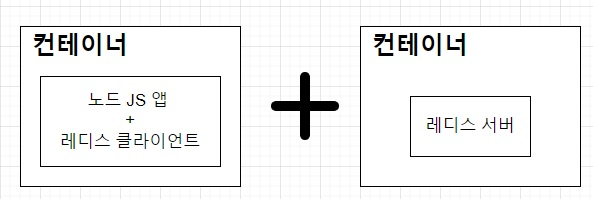
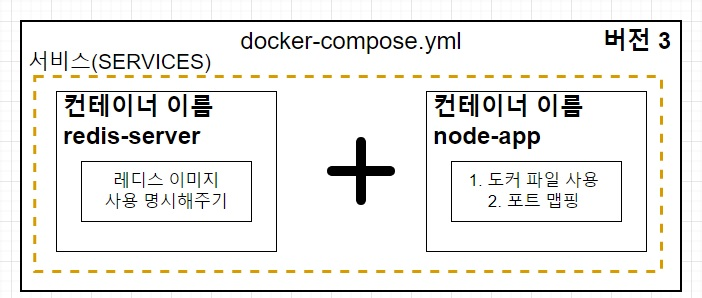

# 06. Docker Compose

## 06-01. Docker Compose란 무엇인가?

**docker compose**

다중 컨테이너 어플리케이션을 정의하고, 실행하기 위한 도구

실습을 해보며 알아보자.


### 실습 내용

페이지를 리프레쉬 했을 때 숫자 0부터 1씩 증가하는 앱을 만들어 보며 Docker Compose를 알아갈 에정.

`docker-compose up`을 사용하여 결과를 확인할 예정.

구성은 nodejs와 redis를 사용할 것이다.


## 06-02. 어플리케이션 소스 작성하기

새 폴더를 만들어 `npm init`으로 package.json을 만들고, script에 server.js를 실행하도록 작성.

```json
{
  "name": "06_docker-compose-app",
  "version": "1.0.0",
  "description": "",
  "main": "server.js",
  "scripts": {
    "start": "node server.js",
    "test": "echo \"Error: no test specified\" && exit 1"
  },
  "author": "",
  "license": "ISC"
}
```

**dependency 추가**

* experss
* redis

```json
{
  ...
  "dependencies": {
    "express": "4.18.2",
    "redis": "3.0.2"
  },
  ...
}
```

**sever.js 작성**

```javascript
// server.js
const express =require("express")
const redis = require("redis");

const app = express();
app.listen(8080);
console.log(`Server is Running!`)
```


본격적으로 시작하기전에 Redis에 대해 알아보자.

### Redis

**Redis(REmote Dictionary Server)**는 **메모리 기반의 키-값 구조 데이터 관리 시스템**.<br/>모든 데이터를 메모리에 저장하고, 빠르게 조회할 수 있는 **비관계형 데이터베이스(NoSql)**이다.

**레디스를 쓰는 이유**

* 메모리에 저장하기 때문에 Mysql같은 데이터베이스에 데이터를 저장하는 거과 데이터를 불러올 때 **훨씬 빠르게 처리**가 가능
* 메모리에 저장하지만 **영속적으로도 보관**가능
* 서버를 **재부팅해도 데이터를 유지**할 수 있다는 장점.


### Node.js에서 Redis 사용방법

1. `redis-server`작동
2. `redis 모듈` 다운
3. redis모듈 받은 후 레디스 클라이언트를 생성하기위해<br/>Redis에서 제공하는 `createClient()`를 이용해 `redis.createClient`로 레디스 클라이언트 생성
4. `redis server`가 작동하는 곳과 `node.js`가 작동하는 곳이 다른 곳이라면 host인자와 port 이자를 명시해주어야한다.

```js
// server.js
...
// redis 클라이언트 생성
const client = redis.createClient({
  host: '',
  port: '6379',
})
...
```

redis의 기본포트가 6379

host에는 도커환경이 아닌데 넣어주는것과, 도커환경일때 넣어주는게 다르다.

만약 Redis 서버가 작동하는 곳이 redis-server.com이라면, Host 옵션을 주면된다.

```javascript
const client = redis.createClient({
  host: 'https://redis-server.com',
  port: '6379',
})
```


### 도커 환경에서 레디스 클라이언트 생성 시 주의사항

도커를 사용하지 않는 환경에서는 보통 Redis서버가 작동되고 있는 곳의 host옵션을 URL로 주면되지만,

도커 Compose를 사용할 때는 **host 옵션을 `docker-compose.yml`파일에 명시한 컨테이너 이름으로 주면된다.**

```javascript
// redis-server로 만든 경우
const client = redis.createClient({
  host: 'redis-server',
  port: '6379',
})
```

### 숫자가 1씩 증가하는 로직 작성

```javascript
// server-redis
const express =require("express")
const redis = require("redis");

// redis 클라이언트 생성
const client = redis.createClient({
  host: 'redis-server',
  port: '6379',
})

const app = express();

// 숫자는 0부터 시작합니다.
client.set("number", 0);
app.get('/', (req, res)=>{
  client.get("number", (err, number)=>{
    // 현재 숫자를 가져온 후 1씩 증가
    // number가 string으로 오기때문에 parse해주어야함.
    client.set("number", parseInt(number)+1)
    res.send(`숫자가 1씩 올라갑니다. 숫자: ${number}`)
  })
})
app.listen(8080);
console.log(`Server is Running!`)
```

❗ number를 받을 떄 숫자가아니라 문자열로오기 때문에 숫자로 파싱해주어야 한다.


## 06-03. Dockefile 작성하기

Nodejs를 위한 이미지를 만들기 위한 Dockerfile작성

지난번과 동일하게 진행

```dockerfile
FROM node:10
WORKDIR /usr/src/app
COPY ./ ./
RUN npm install
CMD ["node", "server.js"]
```


## 06-04. Docker Containers간 통신할 때 나타나는 에러

우선 어떤 식으로 실행되는지 알아보자.



우선 레디스 클라이언트가 동작하려면, 레디스 서버가 켜져있어야 한다.

그래서 레디스 서버 위한 컨테이너를 먼저 실행하고, node js를 위한 컨테이너를 실행.

```shell
docker run redis
```

다른 터미널을 열고 아래 실행

```shell
docker build -t junehyung/docker-compose-app
docker run junehyung/docker-compose-app
```

```shell
Error: Redis connection to redis-server:6379 failed ...
```

위와 같은 에러가 발생한다.

### why?

**서로 다른 컨테이너에 있기 때문에** 컨테이너 사이에 아무런 설정이 없기 때문에 접근할 수 없다.

즉, node js앱에서 레디스 서버에 접근할 수 없다.


### how?

이처럼 멀티 컨테이너 상호아에서 쉽게 네트워크를 연결해주기 위해 사용하는것이 **Docker Compose**다


## 06-05. Redis 업그레이드로 인한 소스코드 수정 (2022-11-28 업데이트)

Redis 2버전을 사용하면 문제가 없지만, 최신 레디스 버전사용시 에러가 남.

아래처럼 수정

```dockerfile
# Dockerfile
FROM node

WORKDIR /usr/src/app

COPY ./ ./

RUN npm install

CMD ["node", "server.js"]
```

```javascript
// server.js
const express = require("express");
const redis = require("redis");

//레디스 클라이언트 생성 
const client = redis.createClient({
  socket: {
    host: "redis-server",
    port: 6379
  }
});

const app = express();
app.get('/', async (req, res) => {
  await client.connect();
  let number = await client.get('number');
  if (number === null) {
    number = 0;
  }

  console.log('Number: ' + number);
  res.send("숫자가 1씩 올라갑니다. 숫자: " + number)

  await client.set("number", parseInt(number) + 1)
  await client.disconnect();
})

app.listen(8080);
console.log('Server is running');
```


## 06-06. Docker Compose 파일 작성하기

docker compose사용을 위해 docker-compose파일을 만들자.

> **docker-compose.yml**
>
> yml파일을 yaml파일이라 한다.
>
> YAML은 ain't markup language의 약자.
>
> 구성 파일 및 데이터가 저장되거나 전송되는 응용 프로그램에서 사용되고, 원래는 XML이나 json포맷으로 많이 쓰였지만, 좀 더 사람이 읽기 쉬운 포맷으로 나타난 것이 yaml


### docker-compose파일 구조



컨테이너를 감싼 것을 서비스라 하며, docker-compose는 버전 지정을 해주어야하는데 3버전을 사용할 것이다.

```yml
version: "3"
services:
	redis-server:
		image: "redis"
  node-app:
  	build: .
  	ports:
  		- "5000:8000"
		
```

* verison 도커 컴포즈의 버전
* services : 이곳에 실행하려는 컨테이너 정의
* redis-server : 컨테이너 이름 (redis-server라고 레디스 이미지 사용 명시)
* image : 컨테이너에서 사용하는 이미지
* node-app : 컨테이너 이름
* build : 현 디렉토리에 있는 Docker file사용
* ports : 포트 매핑 로컬 포트 - 컨테이너 포트

❗ 작성 시 띄어쑤기 주의!


작성 후 `docker-compose up`으로 실행.

이미지를 빌드하고, 이미지를 가져온 후 redis서버를 킨 다음 node컨테이너를 실행한것을 확인할 수 있다.

localhost:5000으로 가보면, 확인 가능


## 06-07. Docker Compose로 컨테이너를 멈추기

한번에 키는 것을 `docker compose up`으로 했다.

중단은 ? => `docker compose down`으로 할 수 있다.

❗ `docker compose up`을 할때는 컴포즈 파일(docker-compose.yml)이 있는 곳에서 해야한다.<br/>


**-d 옵션**

`docker compose -d up`

detached모드로서 앱을 백그라운드에서 실행시킨다.

그래서 앱에서 나오는 output을 표출하지 않는다.

❗ 이렇게 실행하면, 하나의 터미널에서 앱을 작동하고, 중단시킬 수 있다.


다시 해보자.

`docker compuse up --build`로 다시 켜볼 꺼다.

**docker-compose up vs docker compose up --build**

* docker-compose up : 이미지가 없을 떄 이미지를 빌드하고 컨테이너 시작
* docker-compose up --build : 이미지가 있든 없든 이미지를 빌드하고 컨테이너 시작

`docker ps`로 확인해보고, `docker compose down`후 다시 확인 해보면 생겼다 사라지는거 확인이 가능

