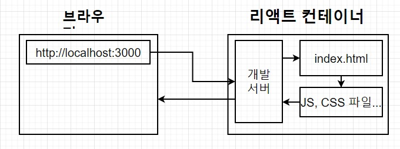
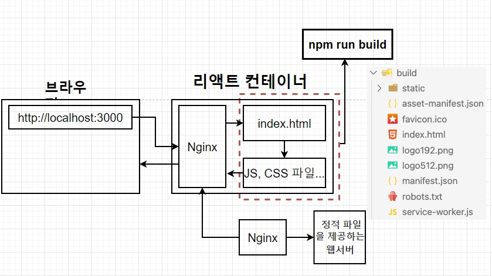
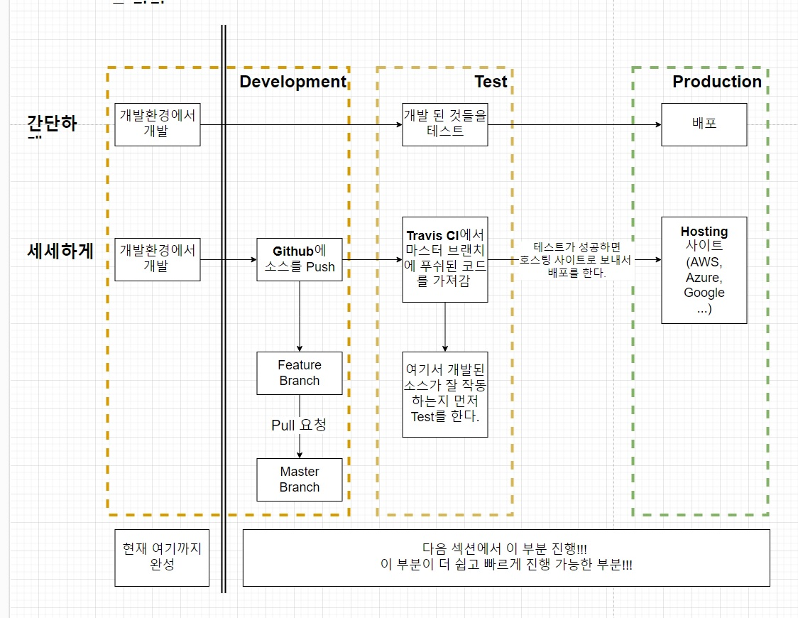

# 07. 간단한 어플을 실제로 배포해보기(개발환경 부분)

## 07-01. 섹션 설명

6, 7강 : 단일 컨테이너 어플리케이션 (리액트)

8, 9강 : 멀티 컨테이너 어플리케이션 (리액트 & 노드 & db 앱개발)

나눠서 진행.

개발환경에서 개발 -> Github에 Push(Feature Branch -> MasterBranch) -> TravisCI 에서 마스터 프랜치에 푸쉬된 코드를 가져가 잘 작동하는지 Test -> 성공 후 호스팅 사이트로 보내 배포.


## 07-02. 리액트 앱 설치하기

node 설치 후 아래 명령어를 통해 react설치

```shell
npx create-react-app ./
```

그 후 각명령어로 확인이 가능.

```shell
# 실행
npm run start

# test
npm run test

# build
npm run build
```


## 07-03. 도커를 이용해 리액트 앱 실행하기

**복습**

도커로 어플을 실행하기 위해서..

`Dockerfile을 작성 -> 도커 이미지 생성 -> 이미지를 이용해 컨테이너 만들기  -> 컨테이너 안에서 앱을 실행하기`

Dockerfile을 만들때 **개발환경과 운영환경을 위한 Dockerfile**을 작성해주어야한다.


개발환경을 위한 Dockerfile을 `Dockerfile.dev`로 만들자.

개발환경에서의 도커파일 작성은 현재까지 도커파일 작성과 동일하다.

```dockerfile
FROM node:alpine
WORKDIR /usr/src/app
COPY package.json ./
RUN npm install
COPY ./ ./
CMD "npm", "run", "start"
```

❗ 먼저, 종속성에 대한 정보가 담긴 pacakge.json을 먼저 COPY하여 불필요한 복사를 줄인다.


```shell
docker build ./
```

로 이미지를 생성하면 error가 발생한다.

원래 이미지를 빌드 할 떄 해당 디렉토리만 정해주면, dockerfile을 알아서 찾는데 docekerfile.dev만 있다.<br/>그래서 자동으로 올바른 도커 파일을 찾지 못해 에러가 발생.

=> **임의로 build시 어떤 파일을 참조할 지 알려준다.**

`-f 참조할 파일이름`을 통해 가능.

```shell
docker build -f Dockerfile.dev .
```


> ❗ Tip
>
> local에 node_modules이 필요하지 않다.
>
> node_modules가 local에있으면 오히려 build시간이 늘어난다.
>
> `COPY ./ ./`를 하기 떄문에 node_modules까지 copy를 한다. 하지만, npm install로 이미 생성됐기 때문에 굳이 필요하지 않다.
>
> 그래서 docker환경에서 할 때는 node_modules를 지워도 된다.


## 07-04. 생성된 도커 이미지로 리액트 앱 실행해보기

`docker run 이미지 이름`으로 실행이 가능.

하지만 `localhost:3000`으로 가면 에러가 난다.


**why?**

이전 처럼 포트 매핑을 해줘야 하는데 안해줬기 때문.

컨테이너 안에서 실행되고 있는 리액트 앱에 도달하지 못함.


`docker run -it -p 3000:3000 이미지 이름` 으로 실행. (앞은 도커의 포트 뒤는 컨테이너 포트)

-i : 상호 입출력.

-t : tty를 활성화해 bash쉘을 사용.

(react쪽 업그레이드로 it를 붙여야 한다고 했는데, 반대로it를 붙이니까 안되서, `docker run -p 3000:3000 이미지 이름` 로 실행함.)


## 07-05. 도커 볼륨을 이용한 소스 코드 변경

이전에 `COPY`대신 `VOLUME`을 이용해 소스를 변경했을 떄 다시 이미지를 빌드하지 않아도 변경한 소스 부분이 애플리케이션이 적용 되었다.

**복습**

COPY 는 local의 파일을 도커 컨테이너에 복사.

VOLUMNE은 local의 파일을 참조.

`docker run -p 3000:3000 -v /usr/src/app/node_modules -v $(pwd):/usr/src/app [이미지 아이디]`

`-v /usr/src/app/node_modules` : 호스트 디렉토리에 node_modules는 없기에 컨테이너에 매핑하지 말라고 하는것

`-v $(pwd):/usr/src/app` : pwd경로에 있는 디렉토리 혹은 파일을 /usr/src/app 경로에서 참조

> ❗ Window에서 Docker Volumne 코드변경 반영안될 떄
>
> ```json
> // package.json
> ...
> "scripts": {
>     "start": "WATCHPACK_POLLING=true react-scripts start",
>     "build": "react-scripts build",
>     "test": "react-scripts test",
>     "eject": "react-scripts eject"
>   },
> ...
> ```
>
> start명령어를 다음과같이 수정하여 해결.
>
> 변경사항 저장후 몇초 후 적용되는 것을 확인.


## 07-06. 도커 컴포즈로 좀 더 간단하게 앱 실행 해보기

이전 명령어가 되게 길었었다.

`docker run -p 3000:3000 -v /usr/src/app/node_modules -v $(pwd):/usr/src/app [이미지 아이디]`

이를 간단히 하게 하기위 해 Docker Compose로 실행.


1. docker-compose.yml 생성.

2. docker-compose.yml 작성

   ```text
   docker-compose.yml
   Version 3 (도커컴포즈의 버전)
   컨테이너이름(react)
   	1. docker파일 사용
   	2. 포트 매핑
   ```

   ```yml
   version: "3"
   services:
     react:
       build:
         context: .
         dockerfile: Dockerfile.dev
       ports:
         - "3000:3000"
       volumes:
         - /usr/src/app/node_modules
         - ./:/usr/src/app
       stdin_open: true
   ```

   * services : 이곳에 실행하려는 컨테이너들을 정의
   * react: 컨테이너 이름
   * build : 현 디렉토리에 있는 Dockerfile 사용
   * context : 도커 이미지를 구성하기 위한 파일과 폴더들이 있는 위치
   * dockerfile : 도커 파일 어떤 것인지 지정
   * ports: 포트 매핑 - `로컬포트 : 컨테이너포트`
   * volumes : 로컬 머신에 있는 파일들 매핑
   * stdin_open : 리액트 앱을 끌때 필요

작성 완료 후 `docker-compose up`으로 실행하여 volume설정까지 잘되있는지 확인.


## 07-07. 리액트 앱 테스트 하기

`npm run test`로 test가 가능헀지만 local에서 module을 지웠기 때문에 에러가 날 것이다.

도커환경에서 테스트 해보자.

`docker run -it 이미지 이름 npm run test`

```shell
docker run -it junehyung/docker-react-app npm run test
```


test소스도 변경사항이 바로 적용되게 할 수 있다.

yml파일에 추가해보자.

```yml
version: "3"
services:
...
  tests:
    build:
      context: .
      dockerfile: Dockerfile.dev
    volumes:
      - /usr/src/app/node_moduels
      - ./:/usr/src/app
    command: ["npm", "run", "test"]
```

이렇게 되면 앱을 시작할 때 2개 컨테이너를 다 시작하게 되니 리액트앱을 실행하고 앱을 테스트도 하게된다.

`docker-compose up --build`

이러면 자동으로 변경된 부분도 다시 테스트한다.

```shell
...
07_docker-react-app-tests-1  | PASS src/App.test.js
07_docker-react-app-tests-1  |   ✓ renders learn react link (39 ms)
07_docker-react-app-tests-1  |   ✓ renders learn react link (6 ms)
07_docker-react-app-tests-1  |   ✓ renders learn react link (7 ms)
07_docker-react-app-tests-1  | 
07_docker-react-app-tests-1  | Test Suites: 1 passed, 1 total
07_docker-react-app-tests-1  | Tests:       3 passed, 3 total
07_docker-react-app-tests-1  | Snapshots:   0 total
07_docker-react-app-tests-1  | Time:        3.236 s
07_docker-react-app-tests-1  | Ran all test suites.
...
```


## 07-08. 운영환경을 위한 Nginx

운영환경(배포 후)을 다뤄보자.


### 왜 Nginx가 필요한가?

개발 환경에서 리액트가 실행되는 과정과 운영환경에서 리액트가 실행되는 과정을 알아보자.

**개발환경에서 리액트가 실행되는 과정**



**운영환경에서 리액트가 실행되는 과정**




리액ㅌ트컨테이너 안에 개발서버와 정적파일들이 있고, 브라우저가 리액트에 요청을 주면 개발서버를 통해 요청한 정적파일을 제공해준다.

운영환경에 가면 그 개발서버가 없어진다.<br/>그래서 정적파일을 제공하는 웹서버가 Nginx.

제공하는 정적파일이 build명령어로 생성된 파일들.

> ❗ 왜 개발환경 서버와 운영환경 서버를 다른거를 써야하는가?
>
> `개발에서 사용하는 서버`는 소스를 변경하면 자도으로 전체 앱을 다시 빌드해서 변경 소스를 반영해주는 것과 같이 `개발환경에 특화된 기능들`이 있기에  **Nginx보다 더욱 복잡함.**(Nginx는 그런게 없다.)
>
> 그래서 운영환경에서는 소스를 변경할 때 다시 반영해 줄 필요가 ㅇ벗으며 개발에 필요한 기능들이 필요하지 않기땜누에 더 깔끔하고 빠른 Nginx를 웹 서버로 사용함.


## 07-09. 운영환경 도커 이미지를 위한 Dockerfile 작성하기

Nginx를 포함하는 **리액트 운영환경 이미지**를 생성해보자.

이미지 생성을 위해 Dockerfile을 작성.

* Dockerfile.dev : 리액트 **개발환경에서 필요한 이미지**를 생성
* Dockerfile : 리액트 **운영환경에서 필요한 이미지**를 생성


**개발환경 도커파일과 운영환경 도커파일 비교**

결과적으로 차이는 마지막 CMD부분의 명령어와 그 이후의 차이가 있다.

운영환경에서는 `npm run build`명령어로 build폴더를 생성한다.

```dockerfile
FROM node:alpine

WORKDIR /usr/src/app

COPY package.json ./

RUN npm install

COPY ./ ./

ENV CHOKIDAR_USEPOLLING=true

CMD ["npm", "run", "build"]

# Nginx 도커 이미지를 이용한
# Nginx 시작
```

build파일을 만들고, 그아래 Nginx서버가 그 파일을 제공함.


운영환경 도커파일 자세히 보기

요약하자면 2가지 단계로 이루어져 있다.

1. 빌드 파일들을 생성 (**Builder Stage**)
2. Nginx를 가동하고, 1번에서 생성된 빌드 폴더의 파일들을 웹 브라우저의 요청에 따라 제공해 준다. (**Run Stage**)

```dockerfile
# builder staage
FROM node:alpine as builder
WORKDIR /usr/src/app
COPY package.json ./
RUN npm install
COPY ./ ./
RUN npm run build


# run stage
FROM nginx
COPY --from=builder /usr/src/app/build /usr/share/nginx/html
```

**Builder Stage**

이곳의 목표는 빌드 파일들을 생성하는것.

생성된 파일과 폴더들은 `/usr/src/app/build`로 들어간다.

* `as builder` : 여기 FROM부터 다음 FROM전까지는 모두 buidler stage라는 것을 명시


**Run stage**

이곳의 목표는 Nginx를 이용해 웹 브라우저의 요청에 따라 정적 파일들을 제공해 주는 것

* FROM nginx : nginx를 위한 베이스 이미지
* COPY --from=builder /usr/src/app/build /usr/share/nginx/html
  * **--from=builder** : 다른 Stage에 있는 파일을 복사할 때 다른 Stage 이름을 명시
  * **/usr/src/app/build** : builder stage에서 생성된 파일들은 /usr/src/app/build에 들어가게 되며 그곳에 저장된 파일들을 /usr/share/nginx/html로 복사를 시켜줘 nginx가 웹브라우저의 http요청이 올때마다 Nginx가 알맞은 파일을 전달할 수 있게 만듬
  * **/usr/share/nginx/html** : 클라이언트의 요청이 들어올 때마다 Nginx가 알맞은 정적 파일을 제공하기 위해 이 장소로 빌드된 파일을 복사.<br/>이 장소는 설정을 통해 변경이 가능


```shell
docker build -t junehyung/docker-react-app ./ 
docker run -p 8080:80 junehyung/docker-react-app
```

nginx는 80포트가 기본포트.

`localhost:8080`으로 가보면 잘 동작하는 것을 볼 수 있다.


**이번강의까지 진행상황**



